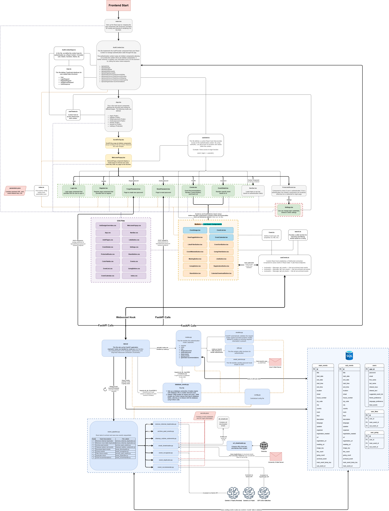

# tuevent - University Event Discovery Platform

**tuevent** is a full-stack web application designed to help university students discover events that happen in Tuebingen. The platform automatically extracts events from university email newsletters using LLM-powered processing, provides personalized event recommendations, and offers a modern user interface.

The productionized application is available via https://tuevent.de/

[](https://www.youtube.com/watch?v=NynK4kjuZIg)

---

## Table of Contents

1. [Overview and Problem Solution](#overview-and-problem-solution)
2. [Tech Stack](#tech-stack)
3. [Project Structure](#project-structure)
4. [Getting Started](#getting-started)
   - [Prerequisites](#prerequisites)
   - [Configuration Files](#configuration-files)
   - [Running with Docker](#running-with-docker)
   - [Running Locally (Development)](#running-locally-development)
5. [Architecture](#architecture)
   - [Frontend-Backend Communication](#frontend-backend-communication)
   - [Authentication System](#authentication-system)
6. [API Reference](#api-reference)
7. [Email Processing Pipeline](#email-processing-pipeline)
8. [Frontend Features](#frontend-features)
9. [Database Schema](#database-schema)
---

## Overview and Problem Solution

Students at the University of Tuebingen are constantly receiving an overload of emails from a variety of sources, many of which are irrelevant to the individual student and not related to any courses they might take. However, many emails also advertise potentially interesting events that the student overlooks because they are buried among unrelated messages.

tuevent solves the problem of information overload for university students by:

- **Automatically extracting events** from university email newsletters (e.g., "Rundmail", "WiWiNews")
- **Using LLMs (Gemini/OpenRouter)** to parse, categorize, and de-duplicate events
- **Providing personalized recommendations** based on user interests and language preferences
- **Offering a modern UI** with list/calendar views, search, filtering, and social features (likes, going)
---

## Tech Stack

### Backend
| Technology | Purpose |
|------------|---------|
| **Python 3.13** | Core programming language |
| **FastAPI** | Web framework for REST API and WebSocket endpoints |
| **SQLAlchemy** | ORM for database operations |
| **SQLite** | Database for storing events and users |
| **APScheduler** | Scheduled task execution for email pipeline |
| **Google Gemini API** | LLM for event extraction and duplicate detection |
| **OpenRouter API** | LLM for event recommendations |
| **JWT** | JSON Web Token authentication |
| **IMAP** | Email retrieval from university mail server |
| **SMTP (Gmail)** | Sending password reset emails |

### Frontend
| Technology | Purpose |
|------------|---------|
| **React 19** | UI framework |
| **TypeScript** | Core programming language (Type-safe JavaScript) |
| **Vite** | Build tool and dev server |
| **Ant Design** | UI component library |
| **React Router** | Client-side routing |
| **WebSocket** | Real-time event data fetching |

### Infrastructure
| Technology | Purpose |
|------------|---------|
| **Docker** | Containerization |
| **Docker Compose** | Multi-container orchestration |

---

## Project Structure



```
data-science-project/
├── README.md                                               # Project overview, setup, and documentation links
├── docker-compose.yml                                      # Compose services for frontend and backend
├── docs/                                                   
│   ├── How_To_Get_Tuevent_Running_in_VSCode_Thumbnail.png  # Thumbnail for VS Code setup video
│   ├── How_To_Get_Tuevent_Running_in_VSCode_Video.mp4      # VS Code setup walkthrough
│   ├── JWT.md                                              # JWT authentication documentation
│   ├── tuevent_architecture.drawio                         # Editable architecture diagram
│   └── tuevent_architecture.png                            # Rendered architecture diagram
├── project/                                                
│   ├── __init__.py                                         
│   ├── backend/                                            
│   │   ├── Dockerfile                                      # Backend container definition
│   │   ├── app.py                                          # FastAPI app entrypoint and routes wiring
│   │   ├── config.py                                       # Central configuration values and constants
│   │   ├── requirements.txt                                # Backend Python dependencies
│   │   ├── secrets.json                                    # Local secrets template (never commit real keys)
│   │   ├── auth/                                           
│   │   │   ├── models.py                                   # Pydantic schemas for auth flows
│   │   │   ├── routes.py                                   # Auth endpoints (register/login/profile/reset)
│   │   │   └── utils.py                                    # JWT, password hashing, and auth helpers
│   │   ├── data/                                           
│   │   │   ├── database/                                   # SQLite databases and ORM models
│   │   │   │   ├── database_events.py                      # SQLAlchemy ORM models
│   │   │   │   ├── tuevent_database.db                     # Primary SQLite database (Created on first run)
│   │   │   ├── logs/                                       # Backend log output
│   │   │   └── temp_emails/                                # Cached raw email bodies
│   │   └── services/                         
│   │       ├── email_service.py                            # SMTP password reset email sender
│   │       ├── event_duplicator.py                         # LLM-based duplicate detection logic
│   │       ├── event_pipeline.py                           # Orchestrates email → extraction → DB insertion
│   │       ├── event_recognizer.py                         # LLM prompts to extract structured events
│   │       ├── event_recommender.py                        # LLM-driven personalized recommendations
│   │       ├── email_downloader/             
│   │       │   ├── email_downloader.py                     # IMAP downloader for university inbox
│   │       │   └── url_downloader.py                       # Fetches content behind newsletter links
│   │       └── event_cleaner/                
│   │           ├── archive_past_events.py                  # Moves past events to archive
│   │           ├── cleanup_orphan_subevents.py             # Removes subevents without parents
│   │           └── remove_internal_duplicates.py           # Deduplicates stored events
│   └── frontend/                             
│       ├── Dockerfile                                      # Frontend container definition
│       ├── eslint.config.js                                # ESLint configuration
│       ├── index.html                                      # HTML entry point for Vite
│       ├── package-lock.json                               # Locked npm dependency graph
│       ├── package.json                                    # Frontend package metadata and scripts
│       ├── tsconfig.app.json                               # TS config for app source
│       ├── tsconfig.json                                   # Base TS config
│       ├── tsconfig.node.json                              # TS config for tooling/node
│       ├── vite.config.ts                                  # Vite build and dev server config
│       └── src/                              
│           ├── App.tsx                                     # Root app component and routing shell
│           ├── assets/                                     # Static assets
│           │   ├── image_labels/                           # Labels for image assets
│           │   └── stock_images/                           
│           │       └── original_quality/                   # Full-resolution stock images
│           ├── components/                   
│           │   ├── EventCalendar.tsx                       # Calendar view for events
│           │   ├── EventImage.tsx                          # Event image renderer with fallbacks
│           │   ├── EventList.tsx                           # List view of events
│           │   ├── NavBar.tsx                              # Top navigation bar
│           │   ├── ProtectedRoute.tsx                      # Route guard for authenticated pages
│           │   ├── ScrollToTop.tsx                         # Scroll reset on route change
│           │   ├── WelcomePopup.tsx                        # First-time visitor popup
│           │   ├── buttons/                  
│           │   │   ├── CalendarDownloadButton.tsx          # ICS download trigger
│           │   │   ├── EventSortButton.tsx                 # Sort options toggle
│           │   │   ├── EventWebsiteButton.tsx              # Link out to event website
│           │   │   ├── GoingButton.tsx                     # Mark attendance toggle
│           │   │   ├── GoingFilterButton.tsx               # Filter list by going status
│           │   │   ├── LikeButton.tsx                      # Like toggle for events
│           │   │   ├── LikedFilterButton.tsx               # Filter list by liked events
│           │   │   ├── MeetingButton.tsx                   # Meeting link/action button
│           │   │   ├── RegistrationButton.tsx              # Registration CTA
│           │   │   ├── ShareButton.tsx                     # Share menu trigger
│           │   │   └── ViewToggleButton.tsx                # Switch list/calendar views
│           │   ├── css/                      
│           │   │   ├── AntDesignOverrides.css              # Custom overrides for Ant Design
│           │   │   ├── App.css                             # Global app styling
│           │   │   ├── AuthPages.css                       # Auth page styling
│           │   │   ├── ColorPalette.css                    # Theme palette tokens
│           │   │   ├── EventCalendar.css                   # Calendar view styles
│           │   │   ├── EventDetail.css                     # Event detail page styles
│           │   │   ├── EventList.css                       # Event list view styles
│           │   │   ├── Events.css                          # Events page layout
│           │   │   ├── GoingButton.css                     # Going button styles
│           │   │   ├── LikeButton.css                      # Like button styles
│           │   │   ├── NavBar.css                          # Nav bar styles
│           │   │   ├── ProtectedRoute.css                  # Protected route styles
│           │   │   ├── Settings.css                        # Settings page styles
│           │   │   ├── ShareButton.css                     # Share button styles
│           │   │   └── WelcomePopup.css                    # Welcome popup styles
│           │   └── pages/                    
│           │       ├── EventDetail.tsx                     # Event detail page
│           │       ├── Events.tsx                          # Main events listing page
│           │       ├── ForgotPassword.tsx                  # Password reset request page
│           │       ├── Login.tsx                           # Login page
│           │       ├── Register.tsx                        # Registration page
│           │       └── ResetPassword.tsx                   # Password reset form page
│           ├── config/                       
│           │   ├── index.ts                                # Config export barrel
│           │   └── parameters.json                         # Frontend runtime parameters
│           ├── context/                      
│           │   └── AuthContext.tsx                         # Auth state and helpers
│           ├── hooks/                        
│           │   ├── useAuth.ts                              # Auth-related hook
│           │   ├── useEvents.ts                            # WebSocket events hook
│           │   └── useTheme.ts                             # Theme toggle hook
│           ├── index.css                                   # Global CSS entry
│           ├── main.tsx                                    # Vite/React bootstrap
│           ├── types/                       
│           │   ├── Event.ts                                # Event type definitions
│           │   └── User.ts                                 # User type definitions
│           └── utils/                        
│               └── search.ts                               # Search/filter helpers
└── test_evaluation/                                        
   └── used_openai-gpt5_2/                                 
      ├── files/                                          
      │   ├── batch_email_downloader.py                     # Batch email download runner
      │   ├── run_download.py                               # Entry to download a batch
      │   ├── run_extract_batch_existing_service.py         # Extraction runner on existing data
      │   └── select_gold_set.py                            # Selects gold-standard set
      ├── outcomes/                         
      │   ├── batch1_evaluation.md                          # Batch 1 evaluation notes
      │   ├── batch2_evaluation.md                          # Batch 2 evaluation notes
      │   ├── batch3_evaluation.md                          # Batch 3 evaluation notes
      │   ├── batch4_evaluation.md                          # Batch 4 evaluation notes
      │   ├── batch5_evaluation.md                          # Batch 5 evaluation notes
      │   └── batch_summary.md                              # Summary across batches
      ├── procedure/                       
      │   ├── procedure_llm_test.md                         # LLM test procedure
      │   └── system_prompt.md                              # Prompt used during evaluation
      └── selected_mails/                   
         └── selection_report.xlsx                          # Spreadsheet of selected emails
```

### File Descriptions

#### Backend Core Files

| File | Description |
|------|-------------|
| `app.py` | FastAPI application with WebSocket endpoints, event endpoints, and scheduler setup |
| `config.py` | Centralized configuration including database URL, JWT settings, CORS origins, scheduler settings, and image key descriptions for event categorization |
| `secrets.json` | Contains API keys and credentials (Gemini, OpenRouter, IMAP, SMTP) |

#### Authentication Module (`auth/`)

| File | Description |
|------|-------------|
| `models.py` | Pydantic models: `UserCreate`, `UserLogin`, `UserUpdate`, `UserResponse`, `TokenResponse`, `PasswordResetRequest`, `PasswordReset` |
| `routes.py` | API routes for register, login, profile management, password reset, and recommendations |
| `utils.py` | Password hashing (bcrypt), JWT creation/validation, `get_current_user` dependency |

#### Database (`data/database/`)

| File | Description |
|------|-------------|
| `database_events.py` | SQLAlchemy ORM models: `MainEventORM`, `SubEventORM`, `UserORM`, `UserLikeORM`, `UserGoingORM` |

#### Services

| File | Description |
|------|-------------|
| `email_service.py` | SMTP email sending for password reset |
| `event_pipeline.py` | Main pipeline orchestrating email download → LLM extraction → duplicate check → database insertion |
| `event_recognizer.py` | Gemini LLM prompts and logic for extracting structured event data from email text |
| `event_duplicator.py` | LLM-based duplicate detection comparing new events against existing database |
| `event_recommender.py` | OpenRouter LLM-based personalized event recommendations |
| `email_downloader/email_downloader.py` | IMAP connection and email retrieval |
| `email_downloader/url_downloader.py` | Fetches and extracts content from URLs in emails |
| `event_cleaner/archive_past_events.py` | Archives events that have passed |
| `event_cleaner/cleanup_orphan_subevents.py` | Removes sub-events without parent main events |
| `event_cleaner/remove_internal_duplicates.py` | LLM-based removal of duplicates within the database |

#### Frontend Core Files

| File | Description |
|------|-------------|
| `App.tsx` | Main layout with routing, theme provider, and navigation structure |
| `AuthContext.tsx` | Authentication state management, login/register/logout functions, like/going toggles |
| `useEvents.ts` | WebSocket hook for real-time event fetching |
| `parameters.json` | Frontend configuration (API URL, interest keywords, language options, timeouts) |

---

## Getting Started

### Prerequisites

- **Docker** and **Docker Compose**
- OR for local development:
  - Python 3.13+
  - Node.js 22+
  - npm

### Configuration Files

#### 1. Backend Secrets (`project/backend/secrets.json`)

Create this file with your API keys and credentials:

```json
{
    "GEMINI_API_KEY": "your-gemini-api-key",
    "OPENROUTER_API_KEY": "your-openrouter-api-key",
    "USER_ZDV": "your-university-email-username",
    "USER_PASSWORD": "your-university-email-password",
    "SMTP_EMAIL": "your-gmail-address@gmail.com",
    "SMTP_PASSWORD": "your-gmail-app-password"
}
```

| Key | Description |
|-----|-------------|
| `GEMINI_API_KEY` | Google Gemini API key for event extraction and duplicate detection |
| `OPENROUTER_API_KEY` | OpenRouter API key for event recommendations |
| `USER_ZDV` | University IMAP email username (ZDV login) |
| `USER_PASSWORD` | University IMAP email password |
| `SMTP_EMAIL` | Gmail address for sending password reset emails |
| `SMTP_PASSWORD` | Gmail App Password (Not your gmail password) |

> **Note**: To get a Gmail App Password, follow Google Settings -> Security & sign-in -> 2-Step Authentication -> App Passwords

#### 2. Backend Configuration (`project/backend/config.py`)

Key settings you may want to modify:

```python
# Database
DATABASE_URL = "sqlite:///./data/database/tuevent_database.db"

# JWT Authentication
JWT_SECRET_KEY = "CHANGE-THIS-IN-PRODUCTION"  # Use a secure random key
ACCESS_TOKEN_EXPIRE_DAYS = 7 # Reduce to 1 hour / 1 day

# CORS Origins (add your frontend URLs)
CORS_ORIGINS = [
    "http://localhost:5173",
    "https://your-domain.com",
]

# Email Pipeline Schedule
EMAIL_PIPELINE_CRON_HOURS = "*/6"  # Run every 6 hours
EMAIL_PIPELINE_DEFAULT_LIMIT = 45   # Process up to 45 emails per run

# LLM Models
RECOGNITION_LLM_MODEL = "gemini-3-flash-preview"
DUPLICATION_LLM_MODEL = "gemini-2.5-flash"
RECOMMENDATION_LLM_MODEL = "gpt-oss-120b:free"
```

#### 3. Frontend Configuration (`project/frontend/src/config/parameters.json`)

```json
{
    "API_BASE_URL": "http://localhost:8000",
    "WS_PORT": 8000,
    "LOCAL": true,
    "POSSIBLE_INTEREST_KEYWORDS": ["Data Science", "Music", ...],
    "POSSIBLE_LANGUAGE_OPTIONS": ["German", "English", ...],
    "PAGINATION": { "EVENTS_PER_PAGE": 20 }
}
```

| Key | Description |
|-----|-------------|
| `API_BASE_URL` | Backend API URL |
| `WS_PORT` | WebSocket port |
| `LOCAL` | Set to `true` for local development, `false` for production |
| `POSSIBLE_INTEREST_KEYWORDS` | Available interest categories for users |
| `POSSIBLE_LANGUAGE_OPTIONS` | Available language preferences |

### Running with Docker

1. **Build and start containers:**

```bash
docker-compose up --build
```

2. **Access the application:**
   - Frontend: http://localhost:5173
   - Backend API: http://localhost:8000
   - API Docs: http://localhost:8000/docs

### Running Locally (Development)

- **VS Code dev container (recommended):** Open the folder in the container; dependencies install automatically via the postCreate command. Use the `Start Application` launch config to start backend and frontend together (ports 8000 and 5173).

- **Backend (manual run):**

```bash
cd project/backend
python -m venv venv
source venv/bin/activate  # Windows: venv\Scripts\activate
pip install -r requirements.txt
uvicorn app:app --reload --host 0.0.0.0 --port 8000
```

- **Frontend (manual run):**

```bash
cd project/frontend
npm install
npm run dev -- --host 0.0.0.0 --port 5173
```

**VSCode Tutorial:**

[](https://www.youtube.com/watch?v=dsuIFUn4dfw)
---

## Architecture

### Frontend-Backend Communication

```
┌─────────────────────────────────────────────────────────────────┐
│                           Frontend                              │
│  ┌─────────────┐    ┌─────────────┐    ┌─────────────────────┐  │
│  │   React     │    │  WebSocket  │    │   REST API Calls    │  │
│  │ Components  │◄───│   Hook      │    │ (fetch with Bearer) │  │
│  └─────────────┘    └──────┬──────┘    └──────────┬──────────┘  │
└────────────────────────────┼──────────────────────┼─────────────┘
                             │                      │
                    ┌────────▼────────┐     ┌───────▼────────┐
                    │  WebSocket      │     │   HTTP REST    │
                    │  /ws/events     │     │   /api/auth/*  │
                    │                 │     │   /api/events/*│
                    └────────┬────────┘     └───────┬────────┘
                             │                      │
┌────────────────────────────┼──────────────────────┼─────────────┐
│                           Backend                 │             │
│  ┌─────────────────────────▼──────────────────────▼───────────┐ │
│  │                      FastAPI App                           │ │
│  │  ┌────────────┐  ┌─────────────┐  ┌──────────────────────┐ │ │
│  │  │ Auth       │  │ Event       │  │ WebSocket Handler    │ │ │
│  │  │ Routes     │  │ Endpoints   │  │ (events broadcast)   │ │ │
│  │  └────────────┘  └─────────────┘  └──────────────────────┘ │ │
│  └────────────────────────────────────────────────────────────┘ │
│                              │                                  │
│  ┌───────────────────────────▼────────────────────────────────┐ │
│  │                    SQLite Database                         │ │
│  │  main_events │ sub_events │ users │ user_likes │ user_going│ │
│  └────────────────────────────────────────────────────────────┘ │
└─────────────────────────────────────────────────────────────────┘
```

#### Communication Methods

1. **WebSocket (`/ws/events`)**: Real-time event data streaming
   - Client sends: `"get_events"`, `"get_sub_events"`, `"get_all_events"`
   - Server responds: JSON array of event objects

2. **REST API**: Authentication and user interactions
   - Uses Bearer token authentication
   - JSON request/response format

### Authentication System

tuevent uses JWT (JSON Web Tokens) for authentication. For detailed documentation on how JWT works in this project, see [docs/JWT.md](docs/JWT.md).

#### Flow Summary

1. **Registration/Login** → Server creates JWT with user ID and expiration
2. **Token Storage** → Frontend stores token in `localStorage`
3. **Authenticated Requests** → Frontend includes `Authorization: Bearer <token>` header
4. **Token Validation** → Backend decodes and verifies signature using `JWT_SECRET_KEY`

#### Token Structure

```json
{
  "sub": "user_id",        // Subject (user ID)
  "exp": 1234567890,       // Expiration timestamp
  "iat": 1234567890        // Issued at timestamp
}
```

---

## API Reference

### Authentication Endpoints

| Method | Endpoint | Description | Auth Required |
|--------|----------|-------------|---------------|
| `POST` | `/api/auth/register` | Register new user | No |
| `POST` | `/api/auth/login` | Login and get token | No |
| `GET` | `/api/auth/me` | Get current user info | Yes |
| `PUT` | `/api/auth/me` | Update user profile | Yes |
| `DELETE` | `/api/auth/me` | Delete user account | Yes |
| `GET` | `/api/auth/liked-events` | Get liked event IDs | Yes |
| `GET` | `/api/auth/going-events` | Get going event IDs | Yes |
| `POST` | `/api/auth/forgot-password` | Request password reset | No |
| `POST` | `/api/auth/reset-password` | Reset password with token | No |
| `POST` | `/api/auth/generate-recommendations` | Trigger LLM recommendations | Yes |

### Event Endpoints

| Method | Endpoint | Description | Auth Required |
|--------|----------|-------------|---------------|
| `POST` | `/api/events/{event_type}/{event_id}/like` | Like an event | Yes |
| `POST` | `/api/events/{event_type}/{event_id}/unlike` | Unlike an event | Yes |
| `POST` | `/api/events/{event_type}/{event_id}/going` | Mark going to event | Yes |
| `POST` | `/api/events/{event_type}/{event_id}/ungoing` | Unmark going | Yes |

> `event_type` is either `"main_event"` or `"sub_event"`

### WebSocket Endpoint

| Endpoint | Messages | Description |
|----------|----------|-------------|
| `/ws/events` | `get_events` | Get non-archived main events |
| | `get_sub_events` | Get non-archived sub events |
| | `get_all_events` | Get all non-archived events |

---

## Email Processing Pipeline

The email pipeline automatically runs every 6 hours (configurable) and performs the following steps:

```
┌─────────────────────────────────────────────────────────────────────────┐
│                    EMAIL-TO-DATABASE PIPELINE                           │
├─────────────────────────────────────────────────────────────────────────┤
│                                                                         │
│  ┌──────────────────────────────────────────────────────────────────┐   │
│  │ STEP 1: CLEANUP - Remove Internal Duplicates                     │   │
│  │ • Uses LLM to identify duplicate events within main_events table │   │
│  │ • Uses LLM to identify duplicate events within sub_events table  │   │
│  │ • Keeps oldest entry, deletes newer duplicates                   │   │
│  └──────────────────────────────────────────────────────────────────┘   │
│                                   ↓                                     │
│  ┌──────────────────────────────────────────────────────────────────┐   │
│  │ STEP 2: CLEANUP - Remove Cross-Table Duplicates                  │   │
│  │ • Finds main_events that are duplicates of existing sub_events   │   │
│  │ • Deletes misclassified main_events                              │   │
│  └──────────────────────────────────────────────────────────────────┘   │
│                                   ↓                                     │
│  ┌──────────────────────────────────────────────────────────────────┐   │
│  │ STEP 3: ARCHIVE - Past Events                                    │   │
│  │ • Sets archived_event=True for events with end_date < today      │   │
│  │ • Main events with sub-events: archives only if ALL subs past    │   │
│  └──────────────────────────────────────────────────────────────────┘   │
│                                   ↓                                     │
│  ┌──────────────────────────────────────────────────────────────────┐   │
│  │ STEP 4: CLEANUP - Orphan Sub-Events                              │   │
│  │ • Deletes sub_events without valid main_event_id                 │   │
│  └──────────────────────────────────────────────────────────────────┘   │
│                                   ↓                                     │
│  ┌──────────────────────────────────────────────────────────────────┐   │
│  │ STEP 5: DOWNLOAD - Fetch Latest Emails                           │   │
│  │ • Connects to university IMAP server                             │   │
│  │ • Downloads latest N emails (default: 45)                        │   │
│  │ • Filters for "Rundmail" or "WiWiNews" emails                    │   │
│  │ • Extracts URLs and fetches their content                        │   │
│  │ • Saves combined text to all_emails.txt                          │   │
│  └──────────────────────────────────────────────────────────────────┘   │
│                                   ↓                                     │
│  ┌──────────────────────────────────────────────────────────────────┐   │
│  │ STEP 6: EXTRACT - LLM Event Recognition                          │   │
│  │ • Sends email text to Gemini LLM                                 │   │
│  │ • LLM extracts structured event data (title, date, location...)  │   │
│  │ • Categorizes events with image_key for display                  │   │
│  │ • Identifies main_events vs sub_events                           │   │
│  │ • Links sub_events to main_events via Main_Event_Temp_Key        │   │
│  └──────────────────────────────────────────────────────────────────┘   │
│                                   ↓                                     │
│  ┌──────────────────────────────────────────────────────────────────┐   │
│  │ STEP 7: FILTER - Future Events Only                              │   │
│  │ • Removes events with end_date < today                           │   │
│  │ • Main events with subs: keeps if ANY sub is in future           │   │
│  └──────────────────────────────────────────────────────────────────┘   │
│                                   ↓                                     │
│  ┌──────────────────────────────────────────────────────────────────┐   │
│  │ STEP 8: DEDUPLICATE - LLM Duplicate Check                        │   │
│  │ • Compares new main_events against existing main+sub events      │   │
│  │ • Compares new sub_events against existing sub+main events       │   │
│  │ • Self-correction: detects misclassified events                  │   │
│  │ • Captures temp_key remaps when a new main_event matches an      │   │
│  │   existing one, so sub_events can be re-linked even if temp keys │   │
│  │   differ                                                         │   │
│  │ • Only inserts genuinely new events (Based on LLM decision)      │   │
│  └──────────────────────────────────────────────────────────────────┘   │
│                                   ↓                                     │
│  ┌──────────────────────────────────────────────────────────────────┐   │
│  │ STEP 9: RECOMMEND - Generate User Recommendations                │   │
│  │ • For each user with interests defined                           │   │
│  │ • Sends user interests + all events to OpenRouter LLM            │   │
│  │ • LLM selects up to 3 most relevant events per user              │   │
│  │ • Updates user.suggested_event_ids                               │   │
│  └──────────────────────────────────────────────────────────────────┘   │
│                                                                         │
└─────────────────────────────────────────────────────────────────────────┘
```

### Event Extraction Details

The LLM extracts the following fields from each event:

| Field | Description |
|-------|-------------|
| `Title` | Event name (generated if not explicit) |
| `Start_Date` / `End_Date` | Event dates (MM/DD/YYYY format) |
| `Start_Time` / `End_Time` | Event times (HH:MM AM/PM format) |
| `Description` | Concise, calendar-friendly description |
| `Location` | Full address string |
| `Street` / `House_Number` / `Zip_Code` / `City` / `Country` | Parsed address components |
| `Room` / `Floor` | Specific venue details |
| `Language` | Event language (English, German, etc.) |
| `Speaker` | Presenter name |
| `Organizer` | Hosting organization |
| `Registration_Needed` | Boolean indicating if you need to register for event|
| `URL` | General event information link |
| `Registration_URL` | Sign-up link |
| `Meeting_URL` | Virtual meeting link (Zoom, Teams, etc.) |
| `Image_Key` | Category for display image (e.g., "ai", "party", "lecture_talk") |
| `Event_Type` | "main_event" or "sub_event" |
| `Main_Event_Temp_Key` | Links sub-events to parent main event |

### Image Key Categories

The system includes 50+ image categories including:
- **Tech/Data**: `ai`, `data_science`, `machine_learning`, `hackathon`
- **Academic**: `colloquium`, `lecture_talk`, `thesis_info`, `exam_prep`
- **Career**: `careerfair`, `company_talk`, `networking`, `resume_workshop`
- **Culture**: `concert_event`, `orchestra`, `theatre`, `film_screening`
- **Social**: `party`, `festival`, `meetup`, `cultural_exchange`
- **Sports**: `sports_course`, `tournament`, `hike_trip`


### Extraction Quality Validation (Reproducible Evaluation)

To ensure that the LLM-based event extraction is reliable for a student-facing website, we implemented and executed an **evaluation workflow** that validates extraction outputs on real university newsletter emails while respecting privacy and API budget constraints.

### What was validated

The evaluation focuses on the most operationally critical fields for students:

- **Title quality** (recognizable, calendar-suitable; not a full-sentence summary)
- **Start/End Date & Time** (most important failure mode; unknown → `null`, no guessing)
- **Location correctness**, including “Location TBA” handling and online/hybrid behavior
- **Registration logic** (`Registration_Needed` consistency with `Registration_URL`)
- **Meeting link placement** (Zoom/Teams/etc. must go to `Meeting_URL`)
- **URL separation** (`URL` vs `Registration_URL` vs `Meeting_URL` must be distinct)
- **Speaker vs Organizer disambiguation**
- **Multi-event correctness** (do not merge distinct events; enforce valid main/sub-event linking)

This aligns the evaluation with real end-user risk: wrong times or wrong logistics directly reduce trust and usability.

### Evaluation design (efficient + auditable)

Because LLM calls are rate-limited and email content is sensitive, evaluation is executed in three reproducible stages:

1. **Freeze a stable raw dataset (batched + idempotent)**
   - 150 “kept” emails are downloaded from IMAP and stored with stable IDs.
   - Stored as per-email JSON + a dataset manifest (`index.json`).

2. **Run extraction batch-wise using the existing production extractor**
   - The dataset is processed in 5 batches of 30 emails.
   - Each batch run produces frozen artifacts (input-to-LLM + raw output + filtered output for evaluation).

3. **Construct a gold set and judge it**
   - A **25-email gold set** is selected (5 emails per batch) using a stratified strategy that includes:
     - multi-event cases, registration-heavy cases, online/hybrid cases, location-risk cases, and borderline/negative cases.
   - The gold set is packaged into a compact “judge packet” (one email text + one prediction JSON per item).
   - Final judging is performed manually in ChatGPT using a binary, field-level rubric (Correct/Incorrect), with brief justification for incorrect fields.

### Outcome summary (high-level)

Overall, extraction performance is **strong on the dominant production class**: clean, single-event announcements with explicit date/time/location and clear registration instructions. These are the emails most important for day-to-day student usage.

Observed issues were concentrated in a smaller subset of structurally complex emails, especially:
- newsletters or series/overview emails that contain multiple distinct sessions, and
- messages that mix deadlines, program periods, optional info sessions, and multiple links.

In these cases, “what counts as the event” is sometimes ambiguous even for humans; evaluation treats this as a known hard class and documents it explicitly.

### Reproducibility and privacy

- Raw email content and intermediate artifacts remain local and are not intended for public commits.
- The evaluation workflow produces deterministic, auditable artifacts (manifest + per-email files + per-batch prediction outputs + frozen gold-set package), enabling repeatable comparisons across future prompt/model revisions without re-downloading or re-labeling the full dataset.

### Where the evaluation artifacts live (local)

Evaluation scripts and artifacts are stored under:

- `test_evaluation/used_openai-gpt5_2/files`


---

## Frontend Features

### Event List

| Feature | Description |
|---------|-------------|
| **List View** | Paginated event cards with images, dates, and descriptions |
| **Calendar View** | Monthly calendar with events displayed on their dates |
| **Search** | Full-text search across event titles, descriptions, speakers, organizers |
| **Sorting** | Sort by date (asc/desc), title, or likes |
| **Filtering** | Filter by liked events, going events, or recommendations |

### Event Interactions

| Feature | Description |
|---------|-------------|
| **Like** | Save events to your liked list |
| **Going** | Mark attendance for events |
| **Share** | Copy event link to clipboard |
| **Calendar Download** | Download .ics file for your calendar |
| **Website Link** | Open event's external URL |
| **Registration Link** | Direct link to event registration |
| **Meeting Link** | Direct link to virtual meeting |

### User Features

| Feature | Description |
|---------|-------------|
| **Registration** | Create account with email, password, interests |
| **Login/Logout** | Secure authentication |
| **Profile Management** | Update name, email |
| **Password Change** | Secure password update |
| **Password Reset** | Email-based password recovery |
| **Interest Settings** | Select interest keywords and preferred language |
| **Dark Mode** | Toggle between light/dark themes |
| **Personalized Recommendations** | LLM-generated event suggestions |

### Sub-Events

- Main events can have multiple sub-events (e.g., conference sessions)
- Sub-events are displayed on the main event's detail page
- Calendar view shows all events (main + sub)
- List view shows main events with expandable sub-events

---

## Database Schema

### Tables

#### `main_events`
| Column | Type | Description |
|--------|------|-------------|
| `id` | String (UUID) | Primary key |
| `title` | String | Event title |
| `start_date` / `end_date` | String | Event dates |
| `start_time` / `end_time` | String | Event times |
| `location` | String | Full address |
| `street` / `house_number` / `zip_code` / `city` / `country` | String | Address parts |
| `room` / `floor` | String | Venue details |
| `description` | Text | Event description |
| `language` | String | Event language |
| `speaker` / `organizer` | String | People involved |
| `registration_needed` | Boolean | Requires registration |
| `url` / `registration_url` / `meeting_url` | String | Related URLs |
| `image_key` | String | Category for display image |
| `like_count` / `going_count` | Integer | Engagement counts |
| `archived_event` | Boolean | Past event flag |
| `sub_event_ids` | JSON | Array of child sub-event IDs |

#### `sub_events`
Same columns as `main_events`, plus:
| Column | Type | Description |
|--------|------|-------------|
| `main_event_id` | String (FK) | Reference to parent main_event |

#### `users`
| Column | Type | Description |
|--------|------|-------------|
| `user_id` | Integer | Primary key (auto-increment) |
| `email` | String | Unique email |
| `password` | String | bcrypt hash |
| `first_name` / `last_name` | String | User name |
| `interest_keys` | JSON | Array of interest keywords |
| `interest_text` | Text | Free-form interest description |
| `suggested_event_ids` | JSON | LLM-recommended event IDs |
| `theme_preference` | String | "light" or "dark" |
| `language_preference` | String | Preferred event language |

#### `user_likes`
| Column | Type | Description |
|--------|------|-------------|
| `id` | Integer | Primary key |
| `user_id` | Integer (FK) | Reference to user |
| `main_event_id` | String (FK) | Reference to main_event (nullable) |
| `sub_event_id` | String (FK) | Reference to sub_event (nullable) |

#### `user_going`
Same structure as `user_likes` for tracking attendance intentions.

---

## Developers

Maurice Schmetzer 

Veja Sovaite

Alexander Unger

